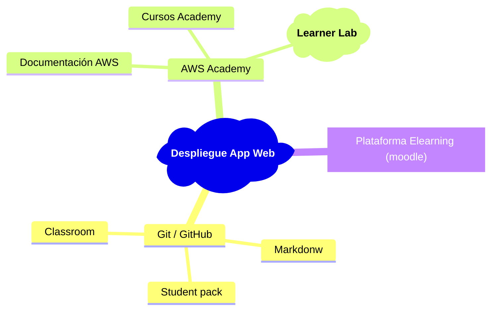
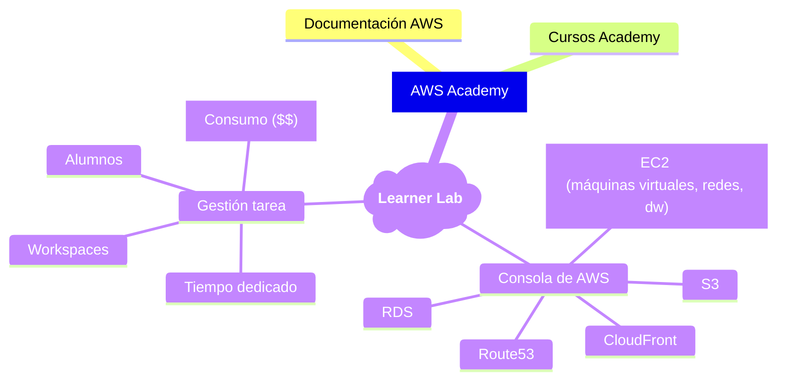

+++
weight = 10
+++

## <i class="fa-solid fa-bullseye"></i> Objetivos

* Mejora de experiencia de usuario   (profesor y estudiantes)
* Uso intensivo de **<i class="fa-brands fa-git"></i>**
* Ni un documento en `word` (<i class="fa-brands fa-markdown"></i>)
* **Democratizar** despliegue
* Poder ayudar **en vivo** a los alumnos en sus despliegues

---

{}

## <i class="fa-solid fa-diagram-project"></i> Esquema 

---

{}
