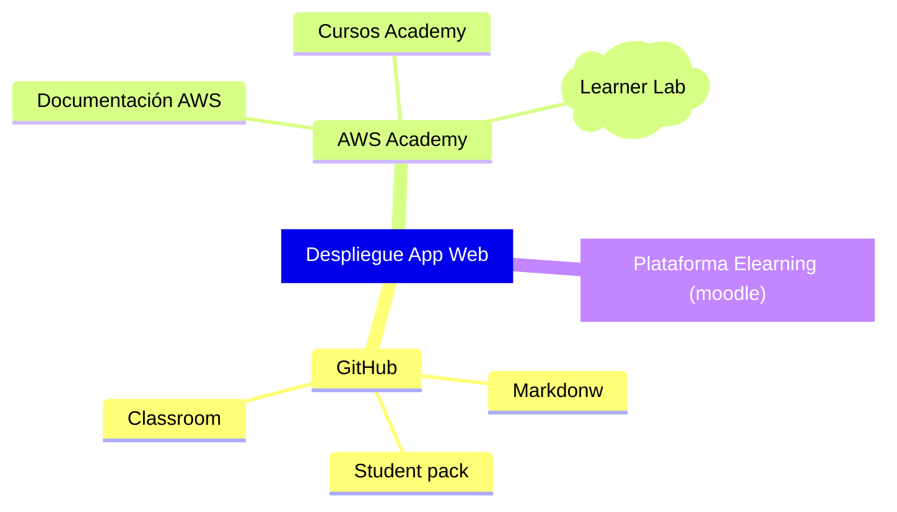
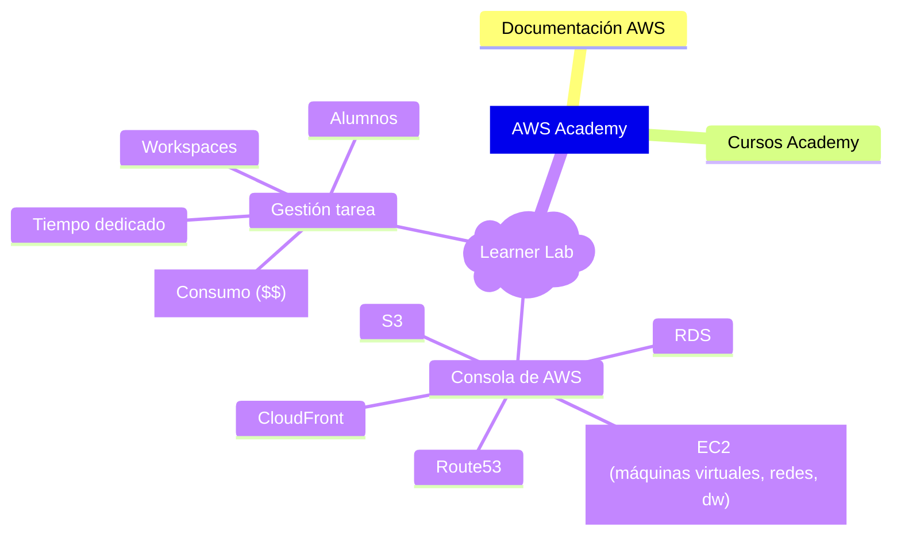

+++
weight = 15
+++

{}

# 2. Mapa

---

## <i class="fa-solid fa-diagram-project"></i> Dibujo 

```mermaid
mindmap
  root[Despliegue App Web]
      GitHub
      ::icon(fab fa-git)
          Markdonw
          ::icon(fa-brands fa-markdown)
          Student pack
          ::icon(fa fa-book)
          Classroom
          ::icon(fab fa-github)
      AWS Academy
      ::icon(fab fa-aws)
          Documentación AWS
          Cursos Academy
          Learner Lab)Learner Lab(
          ::icon(fa fa-circle-right)
      id3["Plataforma Elearning (moodle)"]
      ::icon(fa fa-graduation-cap)

```

---

```mermaid
mindmap
  root[AWS Academy]
  ::icon(fab fa-aws)
      Documentación AWS
      Cursos Academy
      Learner Lab)Learner Lab(
      ::icon(fa fa-circle-right)
      :::urgenst red
        Consola de AWS
          id5["EC2 <br>(máquinas virtuales, redes, dw)"]
          S3
          CloudFront
          RDS
          Route53
        Gestión tarea
          Alumnos
          ::icon(fa fa-person-circle-plus)
          Workspaces
          Tiempo dedicado
          id6["Consumo ($$)"]    
```

{}
